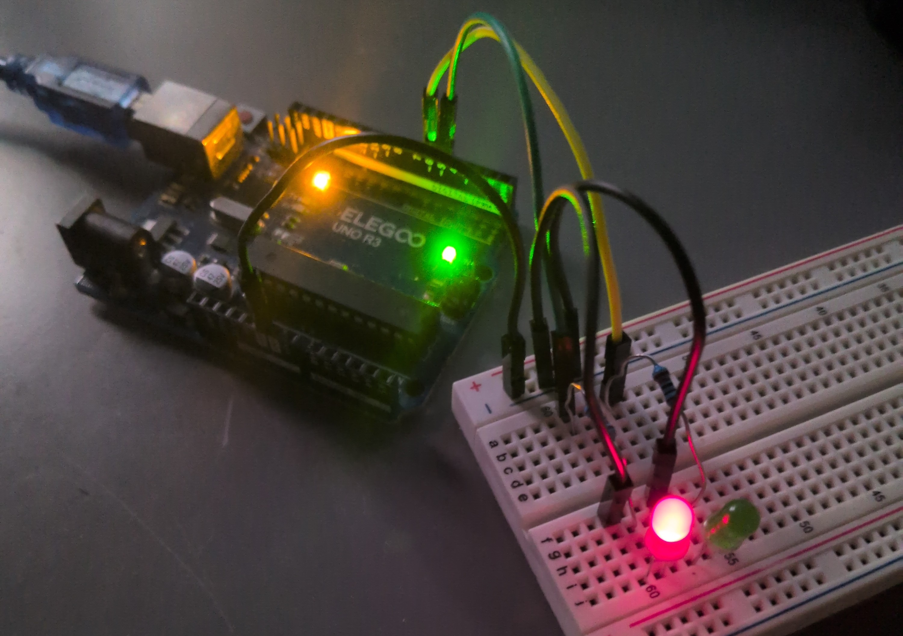
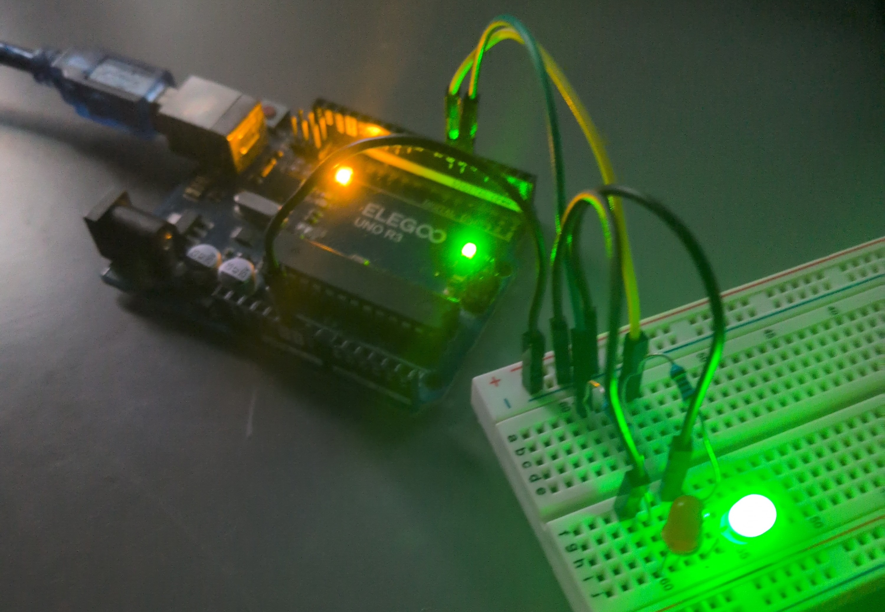

# ESP32_Relay_Switcher

Project focuses on creating code for relay board powered by ESP32.
The board will be put in electric box and will be able to adjust
the work of electricity for house based on the cost of unit
scraped off of company providing the cost.

Simple example with Arduino.

Simple example with Arduino.
