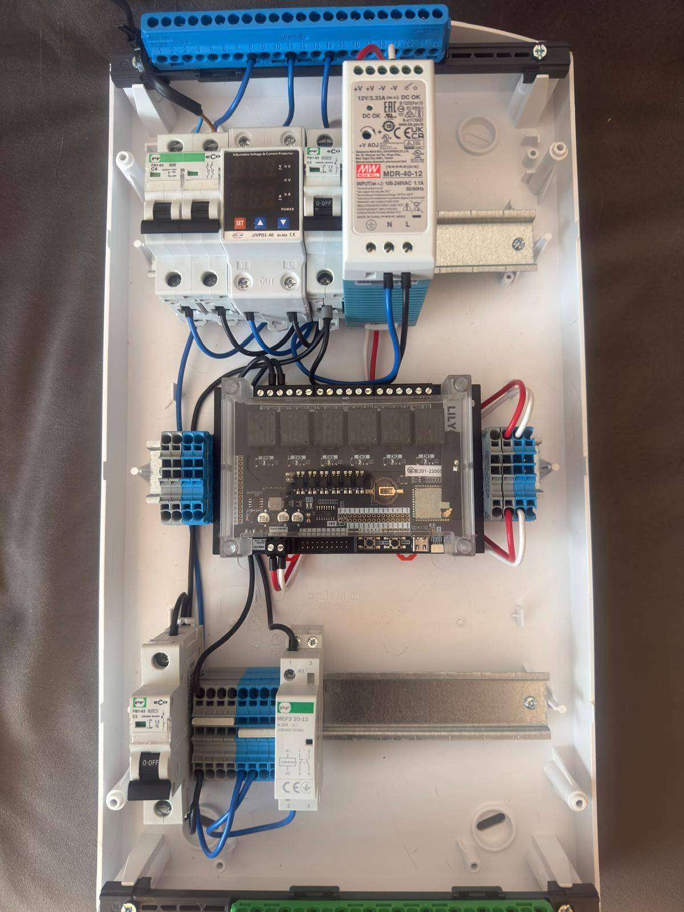

# ESP32_Relay_Switcher

Project focuses on creating code for relay board powered by ESP32S3.
The board will be put in electric box and will be able to adjust
the work of electricity for house based on the cost of unit
scraped off of company providing the cost.

At current stage board is able to segregate pricing pulled from API into 6 groups for each relay powering the cheapest on the CH1 then CH2 and so on.

Project is being developed to use an outside antenna for extended rage for real life use and have an additional screen
on the board for debugging and visualising currents status. 

Test version of the use of board.

Simple example with Arduino.

Simple example with Arduino.
